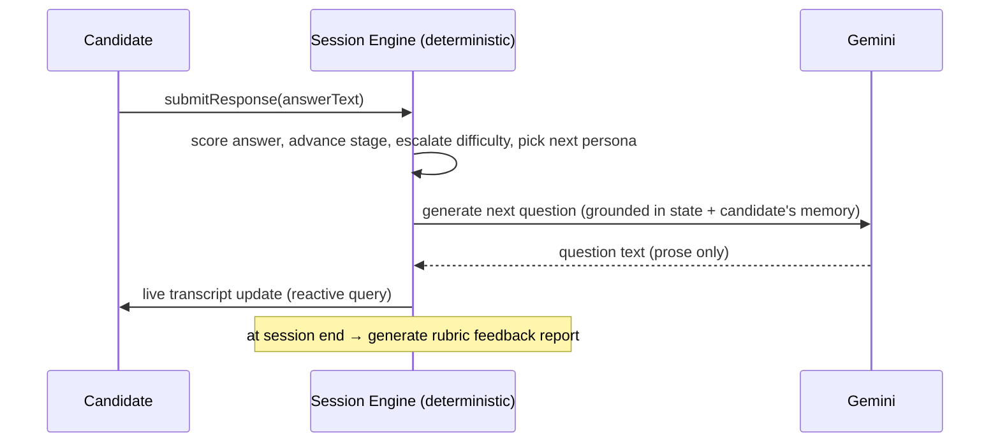

# Project Redefinition — Placement Practice Simulator

> **Working title:** *Abhyaas* (अभ्यास, "practice") — an AI-powered, multi-participant
> practice simulator for campus placement **panel interviews** and **group discussions**.
> (Name is a placeholder; alternatives: *PrepArena*, *MockPanel*, *PanelReady*.)
>
> This document is the ground-up redefinition responding to the Presentation-1 review:
> *"Application & Problem Statement does not justify applicability. Who are the users?
> What are the objectives? What is the outcome/solution?"*

---

## 0. What changed and why (read this first)

The old project — *AI Collaborative Dungeon Master* — was a fantasy storytelling game.
The panel's objection was correct: **it was a solution with no problem.** Entertainment
is also a saturated market — the exact concept (real-time multiplayer AI Dungeon Master)
already ships as **Friends & Fables**, **AI Dungeon**, and free open-source **SillyTavern**,
against a giant (**Character.AI**, which Google paid ~$2.7B to license). A student cannot
win there.

**Key realisation:** the code we built is not really a *game*. It is a **domain-agnostic,
multi-participant simulation engine**:

- a **deterministic turn-based rules engine** (`gameEngine.processAction`) that owns
  authoritative state,
- an **LLM (Gemini) layer confined to narration/dialogue** — it never mutates canonical
  state (so it cannot hallucinate the world into an inconsistent state),
- **agents with personality, goals, relationships, and per-user persistent memory**
  (`npcs` + `npcMemories`),
- **real-time multiplayer** + auth (Convex reactive queries).

We keep that engine and **re-skin the domain** from "fantasy adventure" to "high-stakes
practice conversations." ~85% of the hard engineering is reused; the fantasy world model
(monsters, loot, biomes) is dropped.

---

## 1. Problem Statement

Campus placements decide the outcome of a degree, yet the two most decisive rounds —
the **panel interview** and the **group discussion (GD)** — are precisely the rounds
students cannot practice realistically.

- Human mock interviews **don't scale**: a placement cell cannot give every student
  repeated, individualised panel rounds with faculty acting as interviewers.
- Practising alone is impossible for a GD or a panel — both are **inherently
  multi-participant**.
- Existing AI interview tools (Yoodli, Google Interview Warmup, Final Round AI) are
  **single-candidate, single-interviewer** — they cannot simulate a *panel* of
  interviewers or a *group* of discussants, and they don't **remember and probe** a
  candidate's earlier answers the way a real interviewer does.

**Problem:** *Students lack a scalable, realistic, repeatable way to practise the
multi-participant, high-pressure rounds (panel interviews and group discussions) that
determine placement outcomes, and to receive objective, structured feedback on their
performance.*

## 2. Stakeholders & Users

| Stakeholder | Role | What they gain |
|---|---|---|
| **Job-seeking students** (primary users) | Practise interviews/GDs on demand | Realistic pressure practice + a scored feedback report, unlimited attempts |
| **Training & Placement Cell / trainers** (secondary) | Deploy it, review analytics | Scales mock rounds to the whole batch; cohort readiness dashboards |
| **Faculty / mentors** | Configure scenarios, review transcripts | Targeted coaching based on objective data, not gut feel |
| **Recruiters (future)** | — | Pre-screened, better-prepared candidates |

The **payer/decision-maker** is the placement cell / institution; the **problem-owner**
is the student. Both are unambiguous — which is exactly what the panel asked for.

## 3. Objectives (SMART)

1. **O1 — Panel interview simulation:** A single candidate faces **multiple AI interviewer
   personas** (e.g. HR, technical lead, stress-interviewer) that ask role-appropriate
   questions and **follow up on the candidate's own earlier answers**.
2. **O2 — Group Discussion simulation:** Multiple human participants (optionally with AI
   participants) discuss a topic under an **AI moderator** that manages turns/time and
   scores each participant.
3. **O3 — Realistic difficulty:** Interviewer difficulty **escalates** over the session
   (reuse of the existing `threatLevel` clock).
4. **O4 — Objective feedback:** After each session, auto-generate a **rubric-scored
   feedback report** (per-competency 1–5 with justification and improvement tips).
5. **O5 — Measurable improvement:** Demonstrate **pre/post score improvement** across
   repeated practice sessions in a small user study.

## 4. Proposed Solution & Scope

**In scope (capstone):**
- Two modes: **Panel Interview** and **Group Discussion**, both real-time multiplayer.
- 3–5 configurable **AI interviewer/participant personas** with persistent per-candidate
  memory.
- Deterministic **session engine**: stage progression (intro → technical → behavioural →
  closing), turn/time management, difficulty escalation, and scoring triggers.
- **Rubric-based feedback report** generated per session.
- A **small evaluation study** (see §8).

**Out of scope (state this explicitly — it strengthens the defense):**
- Voice/video/body-language analysis (text-first; a stated future extension).
- Domain-specific certification or any regulated/clinical use.
- Recruiter-facing hiring product.

## 5. Literature Survey

### 5.1 Competitive landscape (the market gap)

| Product | What it does | Limitation we exploit |
|---|---|---|
| Yoodli (yoodli.ai) | AI speech/interview coach, feedback on filler words, pace | Single-participant; no panel, no GD |
| Google Interview Warmup | Practice Qs with transcript | Single interviewer, no scoring depth, no memory |
| Final Round AI / Interviewing.io | Mock interviews / live coaching | 1:1; human-scheduled or single AI |
| Hyperbound, Second Nature | AI **sales** roleplay for corporates | B2B sales only; ~$15k/yr; single-buyer |
| Friends & Fables, AI Dungeon, Character.AI | Multiplayer AI **entertainment** roleplay | Not training; no assessment/feedback |

**Gap:** no tool offers **multi-participant** (panel/GD) practice with **memory-bearing
interviewers** and **objective rubric scoring**. That is our differentiation.

### 5.2 Academic grounding (why this works)

- **Deliberate practice + simulation-based training** is the evidence-backed mechanism:
  repeated practice with feedback in a safe setting improves communication and
  self-efficacy. See StatPearls, *Deliberate Practice in Simulation*
  (https://www.ncbi.nlm.nih.gov/books/NBK554558/); simulation RCT on communication/empathy
  gains (https://pubmed.ncbi.nlm.nih.gov/31794034/).
- **AI standardised patients** — a pilot RCT found AI-driven role-play training
  **non-inferior** to human role-play, with a self-efficacy advantage
  (https://www.medrxiv.org/content/10.64898/2026.04.26.26351793v1.full). Validates
  "AI conversation partner as practice tool."
- *Caveat to state honestly:* strong "AI beats X" percentages are mostly vendor-funded;
  cite the **mechanism** (deliberate practice), not the marketing.

### 5.3 Technical grounding (architecture credibility)

- **Generative Agents** (Park et al., 2023, arXiv:2304.03442) — memory-stream + retrieval
  for LLM agents that "remember." Our per-candidate interviewer memory is a pragmatic
  subset.
- **CoALA — Cognitive Architectures for Language Agents** (arXiv:2309.02427) — principled
  vocabulary (episodic/semantic memory) to describe our persona-memory design.
- **STORY2GAME** (arXiv:2505.03547) — LLM generates narrative while a symbolic engine owns
  state transitions. This is exactly our "LLM narrates, deterministic engine owns state"
  split, and cites *why* pure-LLM state tracking fails (hallucination).
- **CharacterEval** (arXiv:2401.01275) and **CoSER** (arXiv:2502.09082) — rubric
  dimensions for evaluating role-play agents (consistency, fidelity), reused in §8.

**Honest positioning of novelty:** this is an **engineering/systems integration**, not new
ML. The contribution is the *combination* — deterministic state-grounding + per-user agent
memory + concurrent multiplayer + persistence — applied to a real training problem.

---

## 6. System Architecture & Diagrams

### 6.1 High-level components

```mermaid
flowchart TD
    U1[Candidate / Participant browsers] -- Convex reactive queries --> CX[(Convex backend)]
    subgraph CX[Convex backend]
      SE[Session Engine  (deterministic rules)]
      MEM[(Persona memory + transcript)]
      SCH[Scheduler]
    end
    SE -- schedules --> AI[Gemini action: question / follow-up / feedback]
    AI -- writes prose only --> MEM
    SE -- owns authoritative state --> MEM
    CX -- live updates --> U1
```

### 6.2 Session sequence (Panel Interview)



**Design invariant (the technical selling point):** the LLM **only produces text**
(questions, follow-ups, feedback prose). All state — whose turn, which stage, time left,
difficulty, scores — is owned by the deterministic engine. This makes outputs
**consistent, auditable, and objectively measurable** (see §8, Tier-B).

---

## 7. Database Design (revised schema)

Reusing the Convex document model. **Mapping from old → new:**

| Old table | New table | Change |
|---|---|---|
| `rooms` | `sessions` | add `mode: "panel_interview" \| "group_discussion"`, `topic`, `targetRole` |
| `roomPlayers` | `participants` | `role: candidate \| discussant \| observer` |
| `characters` | `participantProfiles` | replace class/stats with `targetRole`, `experienceLevel`, `resumeSummary` |
| `npcs` | `personas` | reuse `personality/goals/mood/relationships`; add `personaRole` (HR/tech/stress/moderator), `strictness`, `focusAreas` |
| `npcMemories` | `personaMemories` | **direct reuse** — interviewer remembers & probes earlier answers |
| `gameStates` | `sessionState` | `currentStage`, `currentQuestion`, `activeSpeaker`, `timeRemaining`, `difficultyLevel` (= old `threatLevel`), `turnIndex` |
| `storyHistory` | `transcript` | Q/A exchanges |
| `playerActions` | `responses` | `answerText` + resolved per-competency scores |
| `gameEvents` | `sessionEvents` | stage transitions, follow-up triggered, etc. |
| — | `feedbackReports` (**new**) | per-competency scores (1–5), strengths, improvements, overall |
| — | `rubrics` (**new**) | competency definitions per mode |
| **dropped** | `monster`, `locations`, `biomes`, `regions`, `buildings`, `worldObjects`, loot/combat | fantasy world model — deleted |

Competency rubric examples — **Interview:** clarity, technical depth, structure (STAR),
confidence, relevance. **GD:** content quality, communication, initiative/leadership,
active listening, collaboration.

---

## 8. Evaluation — the measurable outcomes the panel demanded

A **three-tier** evaluation (do not rely on LLM-as-judge alone):

- **Tier B — objective engine metrics (headline; unique to our architecture):** because the
  deterministic engine owns state, we can measure things pure-LLM tools cannot:
  - **memory-recall accuracy** — did the follow-up correctly reference the candidate's
    earlier answer?
  - **competency coverage** — were all target competencies actually probed?
  - **state/turn consistency** — did the session respect the rules (turn order, time)?
  - **latency** per turn.
- **Tier A — rubric feedback quality:** validate auto-scores against **human raters** on a
  sample (report **Cohen's κ** agreement). Rubric dimensions grounded in CharacterEval/CoSER.
- **Tier C — learning outcome (the gold metric):** small **pre/post user study** — N≈10–20
  classmates do a baseline session, practise several sessions, do a final session; measure
  **score improvement** (repeated-measures). This directly answers "what is the outcome?"

---

## 9. Implementation Roadmap (reuse-first, phased)

1. **Phase 1 — reskin data model:** rename/trim tables per §7; drop fantasy world model.
   Keep the `processAction` turn/phase/threat-clock skeleton.
2. **Phase 2 — Panel Interview mode:** personas as interviewers; adapt `processAction` to
   score-answer → advance-stage → pick-next-persona; adapt Gemini prompt to
   question-generation grounded in persona memory.
3. **Phase 3 — feedback report:** end-of-session Gemini call → rubric JSON → `feedbackReports`.
4. **Phase 4 — Group Discussion mode:** multi-human turn management + AI moderator + AI
   discussants (reuse multiplayer + personas).
5. **Phase 5 — evaluation study & dashboard** (§8) for Presentation-2's "Practical
   Implementation" (30%).

**Presentation-1 (definition-focused) needs only §1–§8** — no new code required yet.
Implementation (§9) is Presentation-2.

---

## 10. Anticipated panel Q&A (defense prep)

- *"How is this different from Yoodli / Google Interview Warmup?"* → They are
  single-participant. We simulate **panels and group discussions** (multiplayer) with
  interviewers that **remember and probe** earlier answers, plus **rubric scoring**.
- *"Isn't the AI just making things up?"* → No. The **deterministic engine owns all state
  and rules**; the LLM only writes question/feedback text. That's why we can produce
  objective metrics (§8, Tier-B). Cite STORY2GAME for the pattern.
- *"What's your technical contribution — you didn't invent the AI?"* → Correct; it's an
  **engineering integration**: deterministic state-grounding + per-user agent memory +
  concurrent multiplayer + persistence, applied to a real assessed training problem.
- *"How do you measure success?"* → Tier-B objective metrics + human-validated rubric
  scores + **pre/post improvement** in a user study (§8).
- *"Who pays / who cares?"* → §2 — students (problem-owners) and the placement cell
  (deployer/payer).
```
